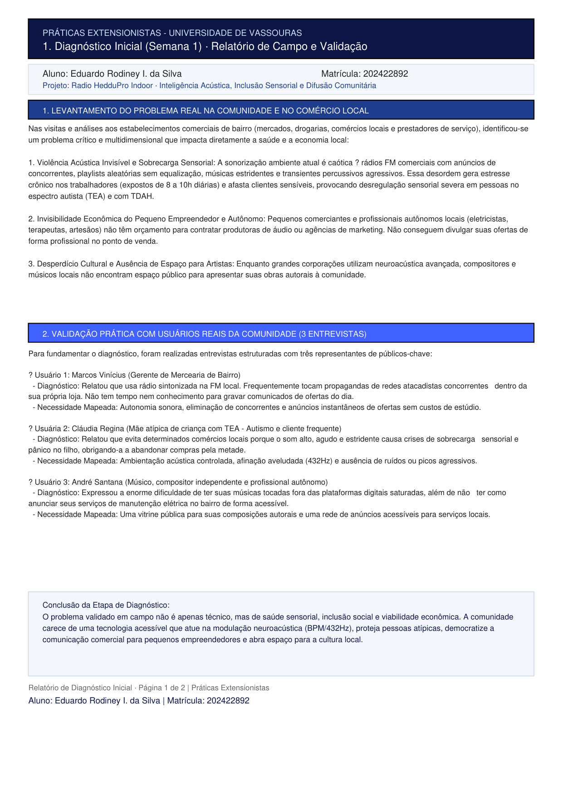
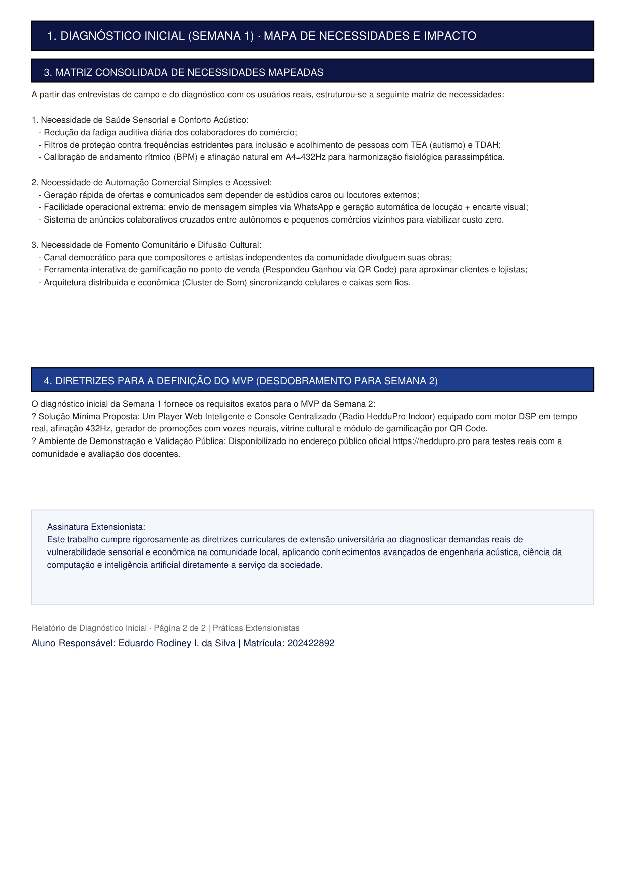
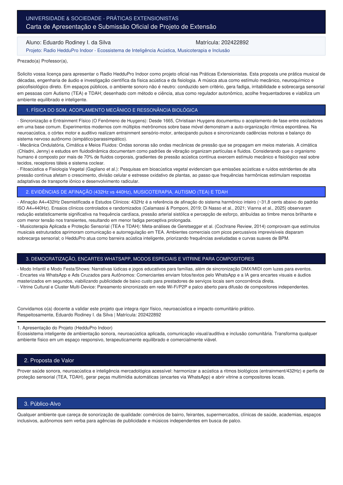
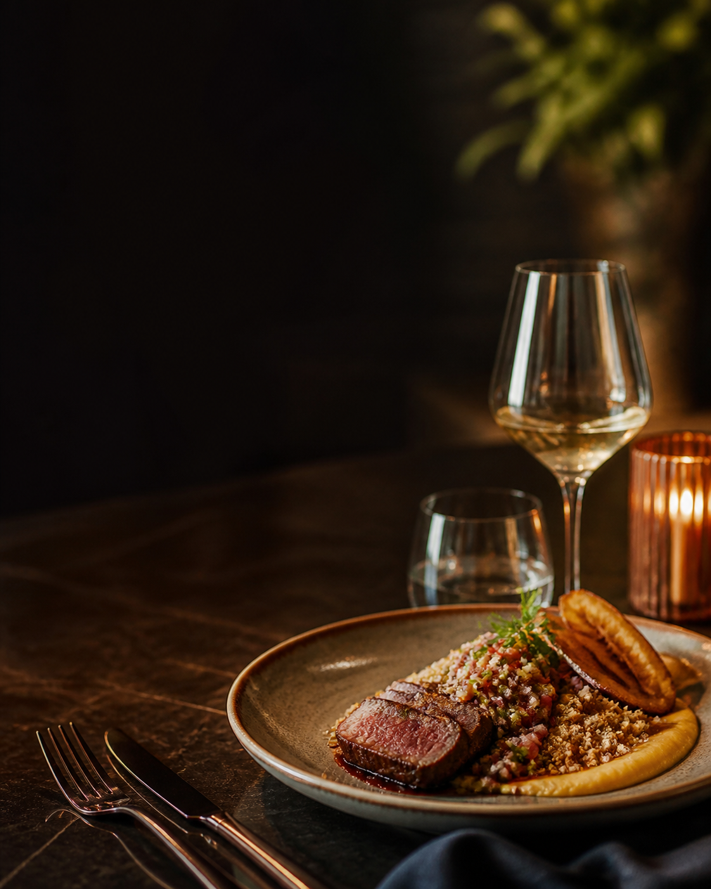
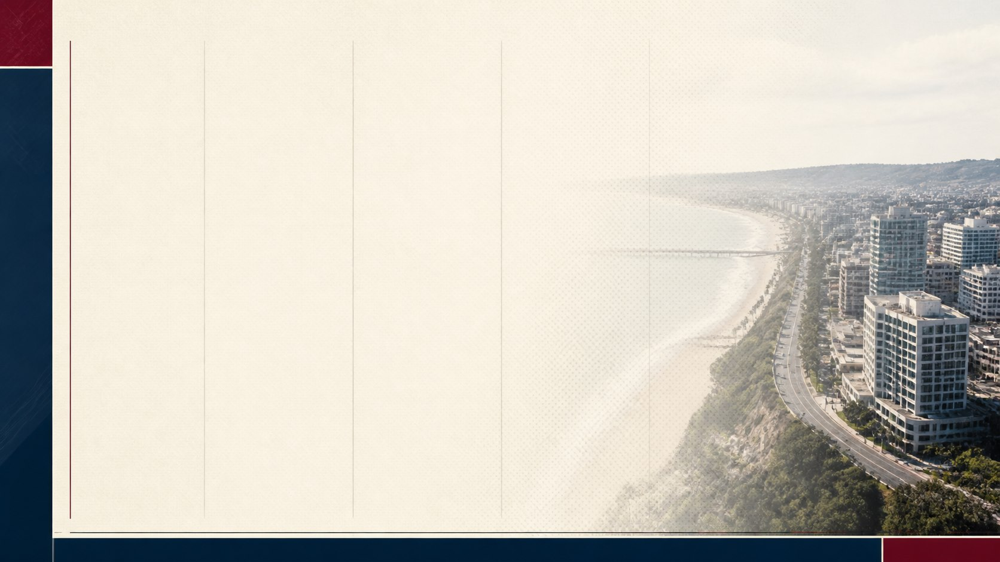

# Radio HedduPro Indoor - Práticas Extensionistas

**Instituição** Universidade de Vassouras  
**Aluno:** Eduardo Rodiney I. da Silva  
**Matrícula:** 202422892  
**Ambiente Oficial de Demonstração (Ao Vivo):** [https://heddupro.pro](https://heddupro.pro)  
**Tela de Exibição / Totem Interativo:** [https://heddupro.pro/ambiente](https://heddupro.pro/ambiente)  

---

## 📾 Acesso Rápido via QR Code do Ponto de Venda

Aponte a câmera do seu celular para abrir o player e a tela inteligente ao vivo:

    
   <b>https://heddupro.pro/ambiente</b>

---

## 🏯 Sobre o Projeto

O **Radio HedduPro Indoor** é um ecossistema computacional e cognitivo para ambientação acústica, neuroacústica aplicada, comunicação comercial colaborativa e difusão cultural comunitária.

Diferente de sistemas tradicionais de som ambiente ou rádios FM comerciais que tocam anúncios de concorrentes dentro de mercadinhos locais, a solução transforma qualquer espaço físico em um ambiente vivo, acústicamente confortável, esteticamente profissional e comercialmente dinâmico.

---

## 📓 Entregáveis Oficiais do Moodle (Semanas 1 e 2)

### 1️⃟ Semana 1 - Diagnóstico Inicial (Ex 1)
*Breve descrição sobre o problema real e as 3 entrevistas de campo.

  
  

### 2️⃟ Semana 2 - Definição do MVP (Ex 2)
*Carta formal do aluno, Lean Canvas do MVP e referências científicas.

  
  

---

## 💻 Telas, Console e Vitrines do Ambiente

  
  

  
  

  
  

---

**Eduardo Rodiney I. da Silva** | Matrícula: 202422892  
*Aluno e Desenvolvedor do Radio HedduPro Indoor*
